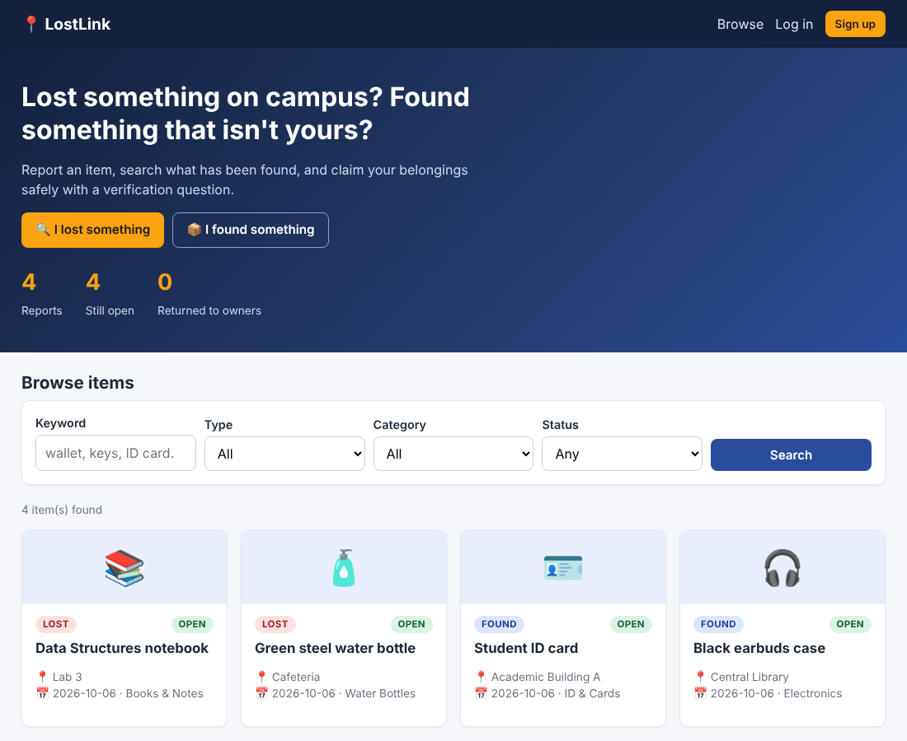
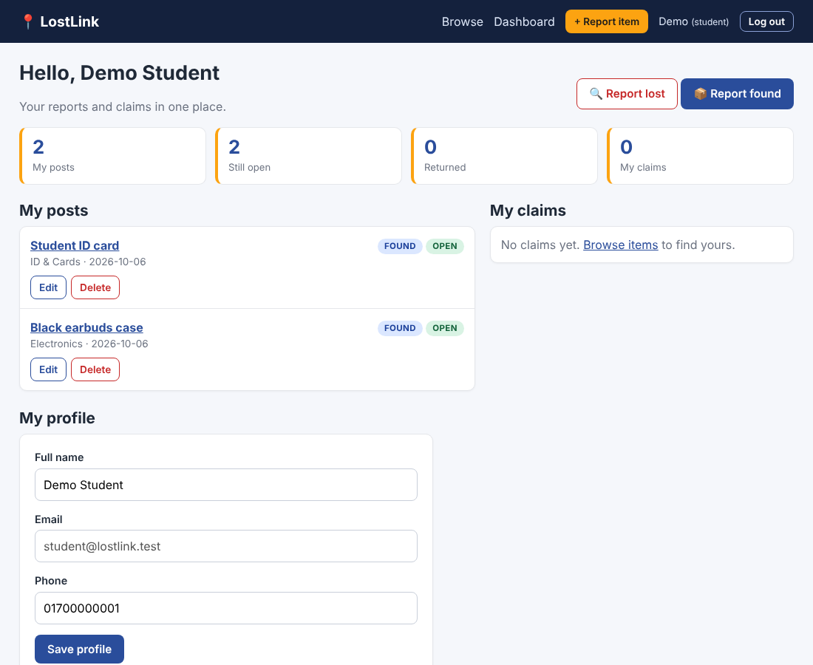
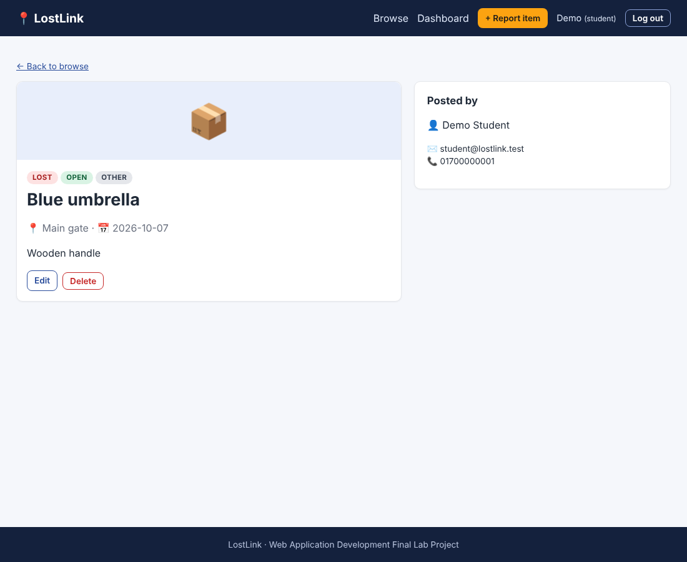
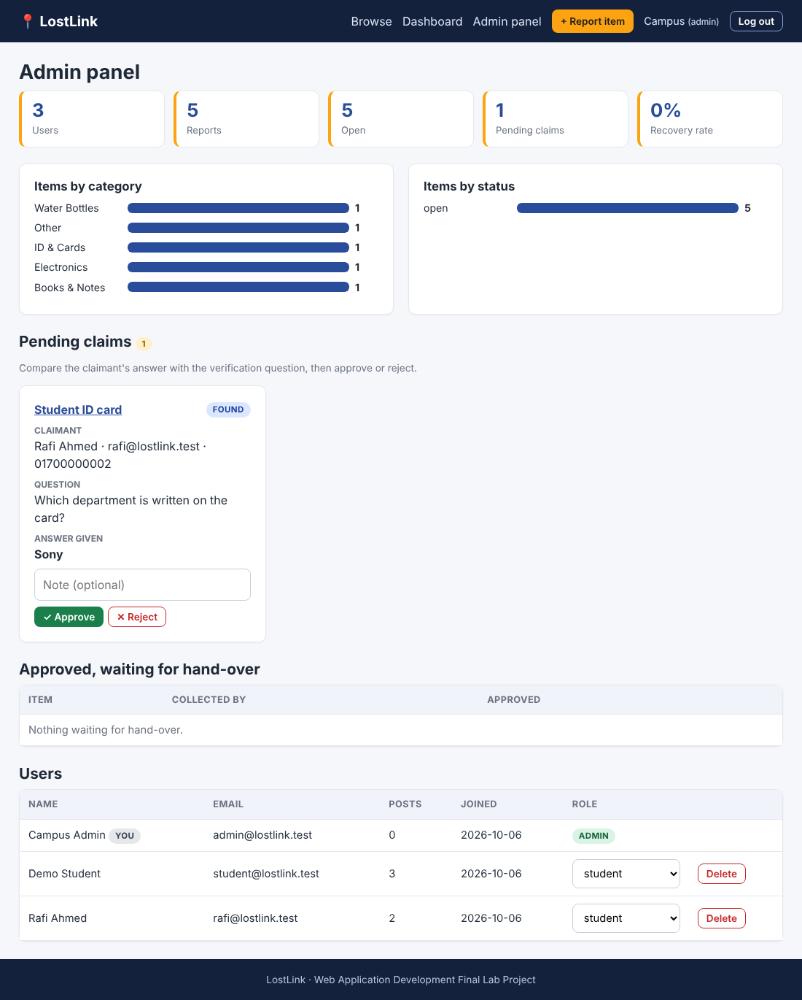
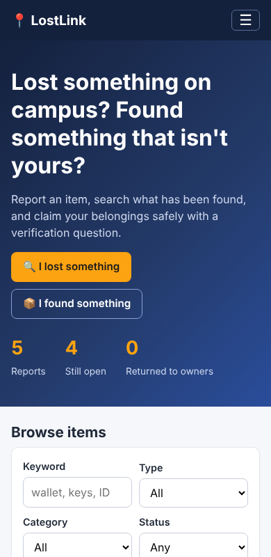
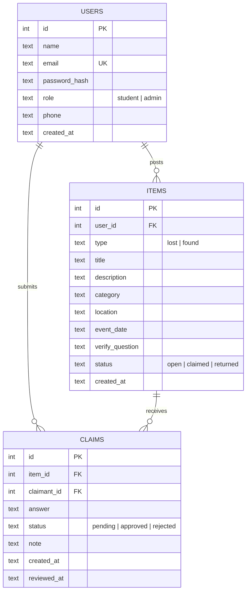

# LostLink: Campus Lost & Found Portal

A simple multi-user web application where students report lost or found items, search the campus board, and claim belongings through an admin-verified process.

> **Course:** Web Application Development Lab (final project)
> **Live site:** _add your deployed link here_
> **Demo video:** _add your YouTube link here_



## Problem

Lost items on campus are reported through scattered notice boards and group chats, so most never reach their owners, and nothing proves who a found item really belongs to.

## Objectives

- Give the campus one searchable place for lost and found reports
- Verify ownership with a question only the real owner can answer
- Let admins review claims and track how many items get returned

## Features

- **Registration, login, logout** with hashed passwords (bcrypt) and two roles: **student** and **admin**
- **Report items (full CRUD):** create, view, edit, delete lost or found reports
- **Search and filter** by keyword, type, category and status
- **Claim workflow:** the finder writes a verification question → the owner answers → the admin approves or rejects → contact details unlock only after approval → the admin marks the item returned
- **Student dashboard:** personal statistics, my posts, my claims, withdraw a claim, edit profile
- **Admin panel:** statistics and recovery rate, bar charts, claim review queue, hand-over list, user and role management
- **Responsive design** (works on phones) and validation on both browser and server

## Screenshots

| Dashboard | Item details |
|---|---|
|  |  |

| Admin panel | Mobile |
|---|---|
|  |  |

## Technologies

| Part | Technology |
|---|---|
| Front-end | HTML5, CSS3 (no framework), vanilla JavaScript (`fetch`) |
| Back-end | Node.js + Express (REST API in one file, `server.js`) |
| Database | SQLite (`better-sqlite3`) |
| Security | bcrypt password hashing, session cookies, role checks on every route, parameterised SQL, output escaping, JSON-only write requests (CSRF defence) |

## System architecture

```
 Browser (HTML + CSS + JavaScript)
        │  fetch() JSON requests
        ▼
 Express server (server.js)  ── sessions, validation, role checks
        │  SQL
        ▼
 SQLite database (data/lostlink.db)
```

## User roles

| Role | Can do |
|---|---|
| Student | Register, post lost/found items, search, claim items, edit or delete own posts, manage own profile |
| Admin | Everything a student can, plus review claims, mark items returned, delete any post, manage users and roles, view reports |

## Database design (ER diagram)



## Folder structure

```
lostlink-simple/
├── server.js          # web server + REST API + database (back-end)
├── package.json
├── public/            # everything the browser loads (front-end)
│   ├── index.html     # home + browse + search
│   ├── login.html     # login and register
│   ├── post.html      # report / edit an item
│   ├── item.html      # item details + claim form
│   ├── dashboard.html # student dashboard + profile
│   ├── admin.html     # admin panel
│   ├── css/style.css
│   └── js/            # common.js (shared helpers) + one script per page
├── test/smoke.js      # automated API test (59 checks)
└── screenshots/
```

## API overview

| Method | Route | Who |
|---|---|---|
| POST | `/api/register`, `/api/login`, `/api/logout` | everyone |
| GET / PUT | `/api/me` | logged in |
| GET | `/api/items`, `/api/items/:id` | everyone |
| POST / PUT / DELETE | `/api/items`, `/api/items/:id` | owner (admin can edit/delete any) |
| POST | `/api/items/:id/claims` | logged-in student |
| DELETE | `/api/claims/:id` | claimant (pending only) |
| GET | `/api/my` | logged in |
| GET / POST / PUT / DELETE | `/api/admin/...` | admin only |

## Run on your computer

Needs [Node.js](https://nodejs.org) LTS.

```bash
npm install
npm start
```

Open **http://localhost:3000**. The database is created and filled with sample data automatically on the first start.

| Role | Email | Password |
|---|---|---|
| Student | student@lostlink.test | student123 |
| Student | rafi@lostlink.test | student123 |
| Admin | admin@lostlink.test | admin123 |

Run the automated tests with `npm test`.

## Deploy for free (Render)

1. Upload this folder to a GitHub repository (`node_modules` and `data` are already git-ignored).
2. On render.com choose **New → Web Service** and connect the repository.
3. Build command: `npm install`. Start command: `npm start`.
4. Add environment variable `SESSION_SECRET` with any long random text.
5. Copy the generated URL into the "Live site" line at the top of this file.

> The free plan uses temporary storage, so the database resets when the service restarts. The sample data is recreated automatically, which is enough for a demo.

## Challenges and solutions

| Challenge | Solution |
|---|---|
| Preventing false claims | Verification question + admin approval + contact details hidden until approval |
| Keeping item status consistent | Approving a claim, rejecting competing claims and updating the item run in one database transaction |
| Showing user text safely | All text is escaped before it is inserted into the page |
| Time zones (Bangladesh is ahead of UTC) | Date fields use the browser's local date and the server allows one day of tolerance |

## Future improvements

- Photo upload for items
- Email or SMS notification when a claim is reviewed
- Separate staff role and categories managed by the admin
- PostgreSQL database for permanent storage on the cloud

## Author

_Your name, student ID, course and instructor._
